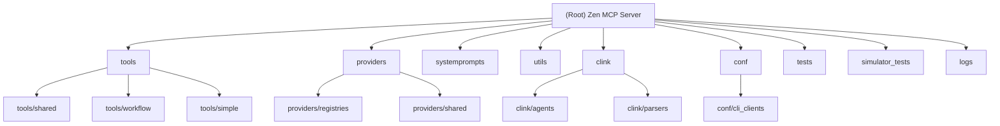

# Zen MCP Server - AI开发上下文文档

## 变更日志 (Changelog)

**2025-11-15**: 初始化AI上下文架构分析，添加模块结构图和详细的模块级文档

---

## 项目愿景

Zen MCP Server是一个多模型AI协作的Model Context Protocol服务器，为Claude Code、Codex CLI、Cursor等AI开发工具提供多模型访问能力。它实现了真正的AI模型间协作，支持跨工具的对话连续性，让开发者能够在一个统一的界面中协调多个AI模型的专长。

## 架构概览

Zen采用模块化架构设计，核心组件包括：

- **MCP服务器核心**: 实现MCP协议，处理工具注册和请求路由
- **工具系统**: 18个专用AI工具，覆盖代码分析、规划、调试等开发场景
- **提供商系统**: 支持8个主流AI提供商的统一抽象层
- **对话内存**: 状态less到stateful的桥梁，支持跨工具连续对话
- **CLink系统**: CLI桥接器，支持外部AI CLI的集成和子代理
- **配置管理**: 灵活的环境变量配置和模型限制管理

## ✨ 模块结构图



## 模块索引

| 模块路径 | 语言 | 职责 | 入口文件 | 测试目录 | 配置文件 |
|---------|------|------|---------|----------|----------|
| `tools/` | Python | AI工具实现，18个专用工具 | `tools/__init__.py` | `tests/test_*.py` | - |
| `providers/` | Python | AI提供商抽象和实现 | `providers/__init__.py` | `tests/test_*provider*.py` | `conf/*_models.json` |
| `systemprompts/` | Python | 系统提示词模板 | `systemprompts/__init__.py` | - | `systemprompts/clink/` |
| `utils/` | Python | 工具函数和共享组件 | `utils/__init__.py` | `tests/test_utils.py` | - |
| `clink/` | Python | CLI桥接器和子代理系统 | `clink/__init__.py` | `tests/test_clink_*.py` | `conf/cli_clients/` |
| `conf/` | Python/JSON | 模型配置和客户端配置 | `conf/__init__.py` | - | `conf/*.json` |
| `tests/` | Python | 单元测试和集成测试 | `tests/conftest.py` | - | - |
| `simulator_tests/` | Python | 端到端模拟测试 | `simulator_tests/base_test.py` | - | - |
| `logs/` | - | 服务器日志和活动跟踪 | - | - | - |

## 运行和开发

### 环境设置
```bash
# 安装和配置服务器
./run-server.sh

# 激活虚拟环境
source .zen_venv/bin/activate
```

### 代码质量检查
```bash
# 运行全面质量检查
./code_quality_checks.sh

# 运行集成测试
./run_integration_tests.sh

# 运行模拟器测试
python communication_simulator_test.py --quick
```

### 服务器管理
```bash
# 查看实时日志
tail -f logs/mcp_server.log
tail -f logs/mcp_activity.log

# 服务器状态检查
./run-server.sh -f
```

## 测试策略

### 测试分层
1. **单元测试** (`tests/`): 模块级别的快速测试，不需要API密钥
2. **集成测试** (`tests/ -m integration`): 使用本地模型的真实API调用测试
3. **模拟器测试** (`simulator_tests/`): 端到端工作流验证，使用真实API密钥

### 推荐测试流程
```bash
# 开发前快速验证
python communication_simulator_test.py --quick --verbose

# 全面功能测试
python communication_simulator_test.py --individual cross_tool_continuation

# 性能和稳定性测试
./run_integration_tests.sh --with-simulator
```

## 编码标准

### 代码风格
- **格式化**: Black (120字符行长度)
- **导入排序**: isort (profile: black)
- **代码检查**: Ruff (pycodestyle, pyflakes, flake8-bugbear)
- **类型检查**: Pydantic v2.0+ 强类型

### 架构原则
- **模块化设计**: 清晰的职责分离和依赖管理
- **提供商抽象**: 统一的AI提供商接口
- **错误处理**: 优雅的降级和用户友好的错误消息
- **性能优化**: 智能token分配和文件去重
- **安全性**: 输入验证和敏感信息保护

## AI使用指南

### 模型选择策略
- **Auto模式**: Claude自动为每个任务选择最佳模型
- **手动指定**: 在提示中明确指定模型名称
- **工作流协作**: 不同模型在不同阶段发挥作用

### 对话连续性
- **跨工具继承**: 分析→调试→修复的完整上下文传递
- **内存管理**: 智能token预算和对话历史压缩
- **上下文复兴**: 即使上下文重置也能恢复对话

### CLink子代理
- **隔离执行**: 在新上下文中运行专用任务
- **角色专业化**: 规划师、代码审查员等特定角色
- **CLI集成**: Gemini CLI、Codex CLI等外部工具桥接

---

## 模块详细文档

各模块的详细文档请参考：
- [Tools模块](./tools/CLAUDE.md) - AI工具实现细节
- [Providers模块](./providers/CLAUDE.md) - AI提供商集成
- [System Prompts模块](./systemprompts/CLAUDE.md) - 提示词工程
- [Utils模块](./utils/CLAUDE.md) - 工具函数库
- [CLink模块](./clink/CLAUDE.md) - CLI桥接系统
- [Configuration模块](./conf/CLAUDE.md) - 配置管理
- [Tests模块](./tests/CLAUDE.md) - 测试框架
- [Simulator Tests模块](./simulator_tests/CLAUDE.md) - 端到端测试

---

## 故障排除

### 常见问题
1. **API密钥配置**: 检查`.env`文件中的密钥设置
2. **模型可用性**: 使用`listmodels`工具检查可用模型
3. **Token限制**: 启用智能文件分块和对话压缩
4. **连接问题**: 检查网络连接和API端点配置

### 调试技巧
```bash
# 启用调试日志
LOG_LEVEL=DEBUG python communication_simulator_test.py

# 检查最近的错误
grep "ERROR" logs/mcp_server.log | tail -20

# 验证工具配置
python -c "from tools import *; print(len(TOOLS))"
```

本上下文文档提供了Zen MCP Server的完整开发指南，确保高效的代码协作和项目维护。